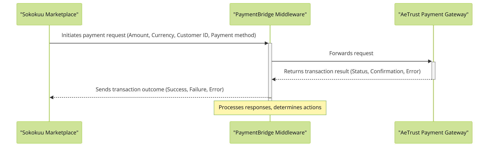

# PaymentBridge

## Description
PaymentBridge is a middleware application designed to facilitate seamless payment processing between the Sokokuu marketplace and various payment gateways. It supports multiple payment methods, including MTN Mobile Money and Visa, providing a secure and efficient way to handle transactions.

*Figure 1: Architectural diagram showing how PaymentBridge interacts with the Sokokuu marketplace and AeTrust payment gateway. The diagram illustrates the flow of data for initiating payments and processing responses, ensuring a seamless transaction experience for users.*

## Table of Contents
- [Installation](#installation)
- [Usage](#usage)
- [Features](#features)
- [Contributing](#contributing)
- [Code of Conduct](#code-of-conduct)
- [License](#license)
- [Credits](#credits)
- [Contact Information](#contact-information)
- [Project Status](#project-status)
- [FAQs](#faqs)

## Installation
To get started with PaymentBridge, follow these steps:
1. Clone the repository:
git clone https://github.com/AeTrade-Group/PaymentBridge-Middleware.git

2. Navigate to the project directory:
cd paymentbridge

3. Install the required dependencies:
mvn install

## Usage
To run PaymentBridge, execute:
java -jar target/paymentbridge-0.0.1-SNAPSHOT.jar

Use this curl command to initiate a payment:
curl -X POST http://localhost:8080/api/payments/initiate -H 'Content-Type: application/json' -d '{ "amount": "100.00", "currency": "USD", "paymentMethod": "Visa", "customerId": "12345", "transactionReference": "trx123" }'

## Features
- **Dynamic Payment Method Selection**: Automatically selects the appropriate payment service based on the payment method specified in the request.
- **Multiple Gateway Support**: Integrates with different payment gateways like MTN Mobile Money and Visa to process payments.
- **Secure Transaction Processing**: Ensures all transactions are processed securely, with robust error handling and validation.

## Contributing
Contributions to PaymentBridge are welcome! If you want to contribute, please:
1. Fork the repository.
2. Create a new branch (`git checkout -b feature-branch`).
3. Make your changes.
4. Commit your changes (`git commit -am 'Add some feature'`).
5. Push to the branch (`git push origin feature-branch`).
6. Create a new Pull Request.

## Code of Conduct
Ensure respectful and constructive communication by adhering to our [Code of Conduct](CODE_OF_CONDUCT.md).

## License
This project is licensed under the MIT License - see the [LICENSE](LICENSE.md) file for details.

## Credits
- **MTN Mobile Money**: For providing robust APIs for mobile payment integration.
- **Visa**: For secure and reliable payment processing services.

## Contact Information
For any queries, please email us at info@aetradegroup.com or visit our [project website](https://aetradegroup.com).

## Project Status
PaymentBridge is currently in active development. We are working on adding more features and expanding support for additional payment gateways.

## FAQs
**Q: What payment methods are supported?**
A: Currently, PaymentBridge supports MTN Mobile Money and Visa.

**Q: How can I report an issue?**
A: Please report issues via the GitHub issue tracker.
"""

